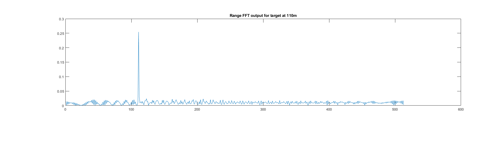
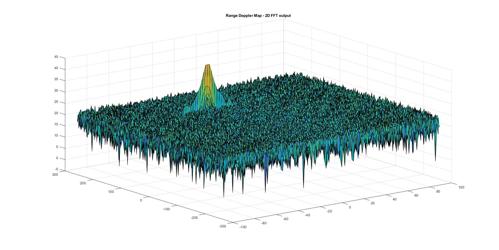
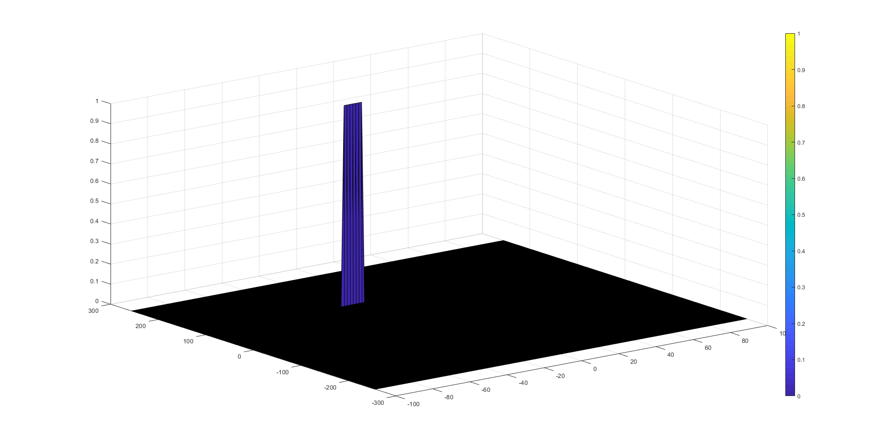

# Radar Target Generation and Detection

This project is part of the Sensor Fusion Nanodegree in Udacity.


## FMCW Waveform Design
Using the given system requirements:


Slope of the chrip was calculated as shown below, result is around 2e13:
```Matlab
%Design the FMCW waveform by giving the specs of each of its parameters.
% Calculate the Bandwidth (B), Chirp Time (Tchirp) and Slope (slope) of the FMCW
% chirp using the requirements above.

% The sweep bandwidth can be determined according to the range resolution
Bs = C / (2 * Dres);

% The sweep time can be computed based on the time needed for the signal to
% travel the unambiguous maximum range. In general, for an FMCW radar system,
% the sweep time should be at least 5 to 6 times the round trip time
Tchirp = 5.5 * 2 * Rmax/C;

% The sweep slope is calculated using both sweep bandwidth and sweep time.
A = Bs/Tchirp;
```

## Simulation Loop
Target movement has been simulated and mixed signal (beat) was calculated for every timestamp as follows:

```Matlab
%% Signal generation and Moving Target simulation
% Running the radar scenario over the time.
for i=1:length(t)

    %For each time stamp update the Range of the Target for constant velocity.
    r_t(i) = Ro + Vo*t(i);

    %For each time sample we need update the transmitted and received signal.
    t_d = 2 * r_t(i) / C;
    Tx(i) = cos(2*pi*(Fc*t(i)+A*t(i)^2/2));
    Rx(i) = cos(2*pi*(Fc*(t(i)-t_d)+A*(t(i)-t_d)^2/2));

    %Now by mixing the Transmit and Receive generate the beat signal
    %This is done by element wise matrix multiplication of Transmit and Receiver Signal
    Mix(i) = Tx(i)*Rx(i);
end
```

## Range FFT (1st FFT)
Range FFT was computed to generate a peak at the initial target range at 110m:



## Range Doppler Map (2D FFT) Output



## 2D CFAR
The 2D CFAR process was implemented in the following steps:
1. Set initial numbers of Training cells for each dimension Tr and Td. Similarly, set initial values for the guard cells Gr and Gd.
2. Slide the Cell Under Test (CUT) across the complete cell matrix
3. Select the grid that includes the training, guard and test cells. Grid Size = (2Tr+2Gr+1)(2Td+2Gd+1).
4. The total number of cells in the guard region and cell under test. (2Gr+1)(2Gd+1).
5. This gives the Training Cells : (2Tr+2Gr+1)(2Td+2Gd+1) - (2Gr+1)(2Gd+1)
6. Measure and average the noise across all the training cells. This gives the threshold
7. Add the offset (tuned later) to the threshold to keep the false positives to the minimum.
8. Determine the signal level at the Cell Under Test.
9. If the CUT signal level is greater than the Threshold, assign a value of 1, else keep it as the initialized value of zero.
10. The parameters Tr, Td, Gr, Gd and offset are tuned to mimize the false positives and detect the target.

Selected initial value for guard cells (Gr, Gd) and training cells (Tr,Td) then kept tuning offset to suppress the false positives, final values are:
```Matlab
%Select the number of Training Cells in both the dimensions.
Tr=12;
Td=12;

%Select the number of Guard Cells in both dimensions around the Cell under
%test (CUT) for accurate estimation
Gr=4;
Gd=4;

% offset the threshold by SNR value in dB
offset=15;
```

Since the cell under test are not located at the edges, due to the training cells occupying the edges, we suppress the edges to zero.

Final output of the CFAR process:

